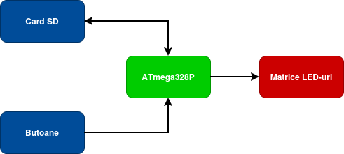
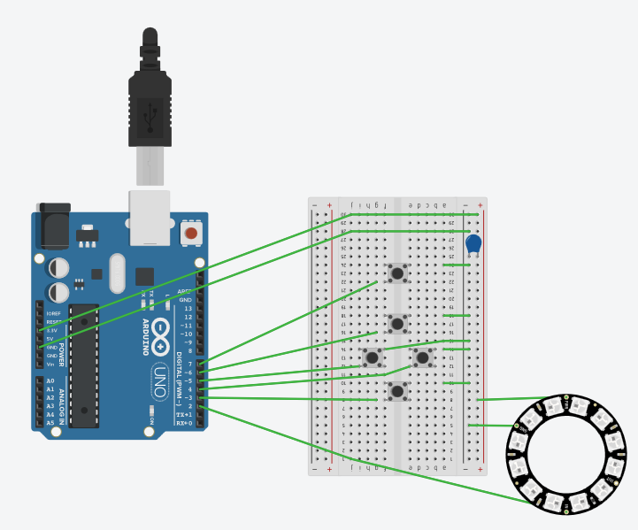
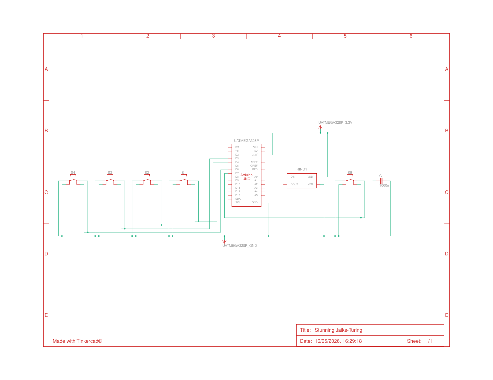

# 8x8 LED Matrix Game Console

A mini game console for an 8x8 WS2812B LED matrix. Built on a standalone **ATmega328P** microcontroller (fully compatible with Arduino Uno/Nano), featuring custom hardware timers, interrupt-driven controls, and multiple games.

## Features

* **Object-Oriented Architecture:** Easily scalable app system using a base `App` class and derived classes for each game/mode.
* **Interrupt-Driven Controls:** Uses Pin Change Interrupts (PCINT) on the ATmega328P for zero-latency, non-blocking button reads with built-in debouncing.
* **Custom Hardware Timer:** Implements a custom `millis()` function using AVR Timer2 (`TIMER2_COMPA_vect`) to handle background timing independently from standard Arduino functions.
* **Smooth Brightness Transitions:** Non-blocking brightness fading system to protect your eyes and power supply during state changes.
* **Animated Menu:** Visual animated icons representing each application for easy navigation.

## Included Games & Apps

1. **Snake:** The classic game. Eat the red apples to grow. Features wrap-around edges.
2. **Connect 4:** A fully functional 2-player Connect 4 game with piece-dropping animations and automatic win/tie detection.
3. **Checkers:** 2-player checkers (draughts) with valid move validation, jumping mechanics, and King promotions.
4. **Message Scroller:** A custom smooth-scrolling RGB text marquee.
5. **Test Mode:** A diagnostic HSV rainbow pattern. You can use the Left/Right buttons in this mode to adjust the global brightness of the matrix.

## Hardware Diagrams

Here is the hardware architecture and wiring for the project:

### Block Diagram

### Electrical Design

### Schematic

## Hardware Requirements

* **ATmega328P** Microcontroller (Standalone or on an Arduino Uno/Nano board)
* 8x8 WS2812B LED Matrix (64 LEDs)
* 5x Push Buttons (Up, Down, Left, Right, Action/Control)
* Jumper wires & Breadboard/PCB
* Appropriate 5V power supply for the LEDs and the microcontroller

## Pin Configuration

| Component | ATmega328P / Arduino Pin | Notes |
|---|---|---|
| **WS2812B Data (DIN)** | `D2` | Connect through a 330Ω resistor (recommended) |
| **Down Button** | `D3` | Uses `INPUT_PULLUP` (wire to GND) |
| **Action/Control Button** | `D4` | Uses `INPUT_PULLUP` (wire to GND) |
| **Right Button** | `D5` | Uses `INPUT_PULLUP` (wire to GND) |
| **Up Button** | `D6` | Uses `INPUT_PULLUP` (wire to GND) |
| **Left Button** | `D7` | Uses `INPUT_PULLUP` (wire to GND) |

*Note: All buttons use internal pull-up resistors. Connect the other side of your buttons directly to GND. No external resistors are needed for the buttons.*

## How to Play

* Use the **Left** and **Right** buttons to navigate the main menu.
* Press the **Action/Control** button to select a game or app.
* To exit any game and return to the main menu, press the **Action/Control** button.
* In *Test Mode*, use **Left** and **Right** to decrease/increase the global brightness.

## License

This project is licensed under the MIT License - see the [LICENSE](LICENSE) file for details.